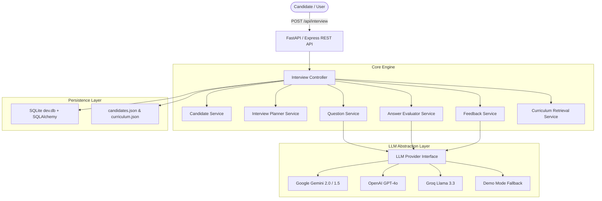
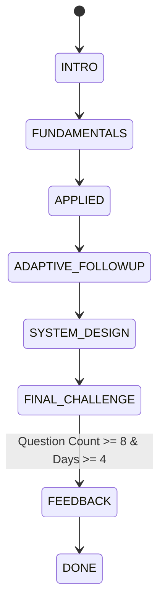

# 🤖 AI Technical Interview Agent

> A production-quality, multi-turn AI Technical Interviewer monorepo built for the 31-day AI Cohort. Personalized to candidate cohort performance data, curriculum objectives, and adaptive follow-up decision logic.

---

## 📁 Repository Structure

```
├── README.md              # Main project documentation & quickstart
├── PROMPTS.md            # Complete LLM system prompt templates & schemas
├── AGENTS.md             # AI agent persona rules & behavioral guidelines
├── technical-spec.md     # HTTP API contract & evaluation requirements
│
├── ai/                   # AI System Documentation Directory
│   ├── PROJECT.md        # Project overview & problem/solution
│   ├── ARCHITECTURE.md   # System architecture, state machine & diagrams
│   ├── CURRENT_STATE.md  # Active implementation & API status
│   ├── DECISIONS.md      # Architecture decision records (ADRs)
│   ├── TASKS.md          # Completed milestones & roadmap
│   ├── SESSION_LOG.md    # Multi-turn turn trace & example log
│   └── AI_MEMORY.md      # Contextual memory & curriculum knowledge bank
│
├── backend/              # Python FastAPI & Express API Server monorepo
├── frontend/             # Next.js 15 App Router Frontend
├── candidates.json       # Grounding dataset: Candidate profiles & mission history
└── curriculum.json       # Grounding dataset: 31-day AI Cohort curriculum
```

---

## 🎯 Problem & Solution

Traditional online assessments use static questionnaires or generic prompt templates that do not reflect candidate experience or real engineering discussions. 

**AI Interview Agent** conducts a realistic multi-turn technical interview that:
- **Understands candidate background**: Reads completed, failed, and skipped missions along with commit signals from `candidates.json`.
- **Grounds questions in curriculum**: Uses 31-day AI cohort curriculum objectives (`curriculum.json`) as knowledge ground truth.
- **Adapts dynamically**: Evaluates candidate answer depth (`STRONG` / `PARTIAL` / `WEAK`) and generates targeted follow-up or diagnostic questions.
- **Guarantees structured feedback**: Returns actionable executive summaries, technical sub-scores, strengths, knowledge gaps, and next steps upon interview completion (minimum 8 questions across at least 4 curriculum days).

---

## 🏗 System Architecture



---

## 🛠 Tech Stack

- **Frontend**: Next.js 15 (App Router), React 19, TypeScript, Tailwind CSS, Lucide React icons.
- **Backend (Primary)**: Python 3.11/3.12, FastAPI, Uvicorn, SQLAlchemy, Pydantic v2, Pytest.
- **Backend (Secondary / Fallback)**: Node.js, Express, TypeScript, tsx.
- **Database**: SQLite (`dev.db`) with SQLAlchemy ORM + static JSON data stores (`candidates.json`, `curriculum.json`).
- **Validation**: Pydantic / Zod (Schema validation for HTTP requests & structured LLM JSON outputs).
- **AI Abstraction**: Multi-provider support for Google Gemini, OpenAI, Groq, and zero-key `DEMO_MODE=true` deterministic execution.

---

## 🔄 Adaptive State Machine



### Evaluation Tiers & Follow-up Logic:
- **STRONG (Score >= 8)**: Challenge with deeper production scaling scenarios or architectural edge cases.
- **PARTIAL (Score 6-7)**: Ask targeted clarification questions focusing on missing concepts.
- **WEAK (Score < 6)**: Friendly conceptual diagnostic question to rebuild fundamental understanding.

---

## 🔌 API Contract (`POST /api/interview`)

### 1. Start Session
```json
POST /api/interview
{
  "sessionId": "session-sarah-101",
  "candidate": { ...candidate.json }
}
```
**Response**:
```json
{
  "reply": "Welcome Sarah Johnson. Let's begin your technical interview...\n\nQuestion 1: ...",
  "done": false
}
```

### 2. Conversation Turn
```json
POST /api/interview
{
  "sessionId": "session-sarah-101",
  "message": "Vector embeddings transform high-dimensional unstructured text into dense vector representations where spatial distance captures semantic relationship."
}
```
**Response**:
```json
{
  "reply": "Good point on dense representations. Now how would you handle HNSW indexing under strict 50ms p99 SLAs?",
  "done": false
}
```

### 3. Interview Completion
**Response**:
```json
{
  "reply": "Interview completed.",
  "done": true,
  "feedback": {
    "summary": "Demonstrated impressive technical depth across AI engineering fundamentals...",
    "strengths": ["Strong understanding of vector database indexing", "Clear communication of trade-offs"],
    "gaps": ["ANN graph parameter tuning", "Production observability"],
    "next": ["Review HNSW efConstruction parameter", "Practice building custom MCP tools"],
    "subScores": {
      "technicalDepth": 88,
      "systemDesign": 82,
      "communication": 90,
      "adaptability": 85
    }
  }
}
```

---

## 🚀 Quickstart & Local Setup

### 1. Prerequisites
- Node.js `v20+` & `npm`
- Python `3.11+` (with `uvicorn` and `fastapi` installed or auto-detected)

### 2. Installation
```bash
# Install dependencies
npm install
```

### 3. Environment Variables
Copy `.env.example` to `.env`:
```bash
cp .env.example .env
```

### 4. Running Dev Server
```bash
# Starts Python FastAPI backend (Port 4000) and Next.js frontend (Port 3000)
npm run dev
```

### 5. Running Tests
```bash
# Runs backend end-to-end integration test suite
npm run test
```

---

## ⚡ DEMO_MODE (Zero-Key Execution)

Set `DEMO_MODE=true` in `.env` to run the complete multi-turn adaptive interview application deterministically without requiring an active OpenAI/Gemini/Groq API key.
