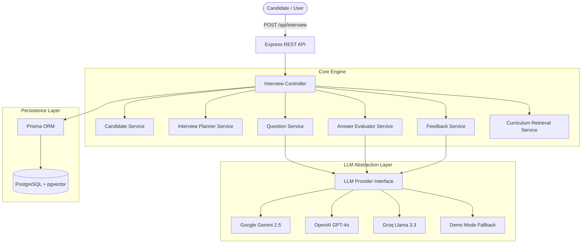
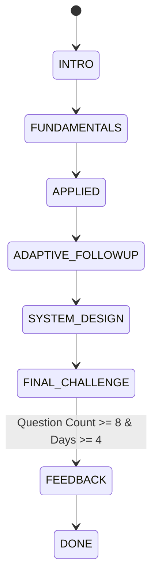

# 🤖 AI Technical Interview Agent

> A production-quality, multi-turn AI Technical Interviewer monorepo built for the 31-day AI Cohort. Personalized to candidate cohort performance data, curriculum objectives, and adaptive follow-up decision logic.

---

## 🎯 Problem & Solution

Traditional online assessments use static questionnaires or generic prompt templates that do not reflect candidate experience or real engineering discussions. 

**AI Interview Agent** conducts a realistic multi-turn technical interview that:
- **Understands candidate background**: Reads completed, failed, and skipped missions along with commit signals.
- **Grounds questions in curriculum**: Uses 31-day AI cohort curriculum objectives as knowledge ground truth.
- **Adapts dynamically**: Evaluates candidate answer depth (STRONG / PARTIAL / WEAK) and generates targeted follow-up or diagnostic questions.
- **Guarantees structured feedback**: Returns actionable executive summaries, technical sub-scores, strengths, knowledge gaps, and next steps upon interview completion (minimum 8 questions across at least 4 curriculum days).

---

## 🏗 System Architecture



---

## 🛠 Tech Stack

- **Frontend**: Next.js 15 (App Router), React 19, TypeScript, Tailwind CSS, Lucide React icons.
- **Backend**: Node.js, Express, TypeScript, Vitest, Supertest.
- **Database**: PostgreSQL with Prisma ORM (and pgvector extension support).
- **Validation**: Zod (Schema validation for HTTP requests & structured LLM JSON outputs).
- **AI Abstraction**: Multi-provider support for Google Gemini, OpenAI, Groq, and zero-key `DEMO_MODE=true` deterministic execution.

---

## 🔄 Adaptive State Machine



### Evaluation Tiers & Follow-up Logic:
- **STRONG (Score >= 8)**: Challenge with deeper production scaling scenarios or architectural edge cases.
- **PARTIAL (Score 5-7)**: Ask targeted clarification questions focusing on missing concepts.
- **WEAK (Score < 5)**: Friendly conceptual diagnostic question to rebuild fundamental understanding.

---

## 💾 Database Schema (Prisma PostgreSQL)

- **`Candidate`**: Identity, experience, status, commit days, missions completed, first-try signals.
- **`Mission`**: Day number, title, passed, skipped, attempt counts.
- **`InterviewSession`**: Session state, question count, current day/topic, difficulty, timestamps.
- **`InterviewMessage`**: Multi-turn chat transcript records with question numbers and curriculum days.
- **`AnswerEvaluation`**: Score (0-10), correctness, technical depth, communication, missing concepts, strengths, weaknesses.
- **`InterviewFeedback`**: Final summary, strengths, gaps, next steps, and competency sub-scores.
- **`CurriculumChunk`**: 31-day curriculum topics, tools, and objectives.

---

## 🔌 API Contract (`POST /api/interview`)

### 1. Start Session
```json
POST /api/interview
{
  "sessionId": "session-sarah-101",
  "candidate": { ...candidate.json }
}
```
**Response**:
```json
{
  "reply": "Welcome Sarah Johnson. Let's begin your technical interview...\n\nQuestion 1: ...",
  "done": false
}
```

### 2. Conversation Turn
```json
POST /api/interview
{
  "sessionId": "session-sarah-101",
  "message": "Vector embeddings transform high-dimensional unstructured text into dense vector representations where spatial distance captures semantic relationship."
}
```
**Response**:
```json
{
  "reply": "Good point on dense representations. Now how would you handle HNSW indexing under strict 50ms p99 SLAs?",
  "done": false
}
```

### 3. Interview Completion
**Response**:
```json
{
  "reply": "Interview completed.",
  "done": true,
  "feedback": {
    "summary": "Demonstrated impressive technical depth across AI engineering fundamentals...",
    "strengths": ["Strong understanding of vector database indexing", "Clear communication of trade-offs"],
    "gaps": ["ANN graph parameter tuning", "Production observability"],
    "next": ["Review HNSW efConstruction parameter", "Practice building custom MCP tools"]
  }
}
```

---

## 🚀 Quickstart & Local Setup

### 1. Prerequisites
- Node.js `v20+` & `npm`
- (Optional) Docker Compose for PostgreSQL + pgvector container

### 2. Installation
```bash
# Install all dependencies across monorepo
npm install
```

### 3. Environment Variables
Copy `.env.example` to `.env`:
```bash
cp .env.example .env
```

### 4. Database Setup & Seeding
```bash
# Push Prisma schema to PostgreSQL
npm run db:push

# Seed candidates.json and curriculum.json into database
npm run db:seed
```

### 5. Running Dev Servers
```bash
# Start backend Express server (Port 4000) and Next.js frontend (Port 3000)
npm run dev
```

### 6. Testing
```bash
# Run backend Vitest integration test suite (16 scenarios)
npm run test
```

---

## ⚡ DEMO_MODE (Zero-Key Execution)

Set `DEMO_MODE=true` in `.env` to run the complete multi-turn adaptive interview application deterministically without requiring an active OpenAI/Gemini/Groq API key.
