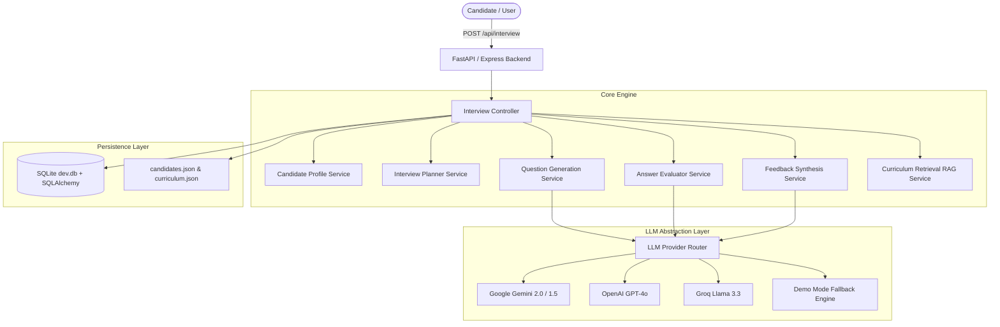
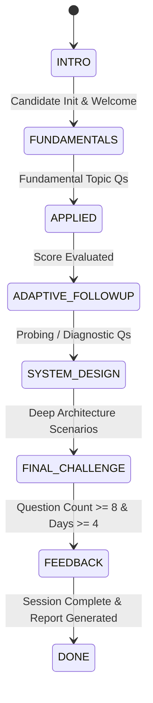
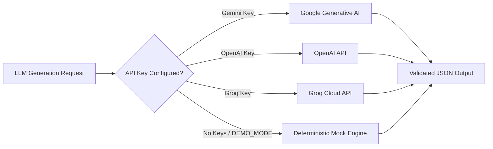

# 🏗 AI Technical Interview Agent - System Architecture

This document describes the high-level and detailed architecture of the AI Technical Interview Agent, including component interaction, multi-turn state machine transitions, data models, and LLM abstraction layers.

---

## 1. Core Architecture Diagram

---

## 2. Adaptive State Machine Flow

The interviewer progresses through structured interview phases based on curriculum objectives and candidate evaluation scores.

### Phase Definitions:
- **`INTRO`**: Candidate background analysis (`candidates.json`), experience assessment, initial greeting.
- **`FUNDAMENTALS`**: Questions probing core concepts (Day 1-10 curriculum objectives).
- **`APPLIED`**: Hands-on implementation scenarios (Day 11-20 objectives).
- **`ADAPTIVE_FOLLOWUP`**: Generated dynamically based on response quality:
  - **`STRONG` (Score >= 8)**: Deeper production edge cases and scaling scenarios.
  - **`PARTIAL` (Score 6-7)**: Targeted clarifying questions focusing on missing nuances.
  - **`WEAK` (Score < 6)**: Friendly diagnostic hint or fundamental concept reset.
- **`SYSTEM_DESIGN`**: End-to-end AI system architecture and optimization questions.
- **`FINAL_CHALLENGE`**: Advanced troubleshooting or trade-off evaluation.
- **`FEEDBACK`**: Generates comprehensive final report when at least 8 questions across 4 curriculum days are completed.

---

## 3. Storage & Schema Model (SQLite & JSON)

- **`Candidate`**: Candidate profile, job role, experience level, completed missions, skipped missions.
- **`InterviewSession`**: Session state, candidate ID, current day, question count, difficulty level, completion flag.
- **`InterviewMessage`**: Turn-by-turn chat transcript records with timestamps and curriculum day mapping.
- **`AnswerEvaluation`**: Score (0-10), correctness tier, depth classification, communication rating, missing concepts.
- **`InterviewFeedback`**: Final report summary, strengths, knowledge gaps, next steps, sub-scores (0-100).
- **`CurriculumChunk`**: 31-day curriculum topics, objectives, tools, and code snippets (`curriculum.json`).

---

## 4. Multi-Provider Fallback Logic

If an external LLM call fails or rate-limits, the system gracefully falls back to deterministic rule-based output, ensuring zero downtime for candidate interviews.
